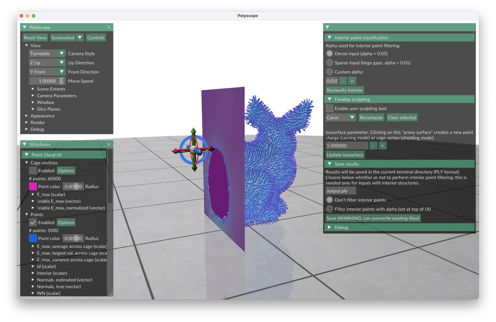

# Faraday Cage Estimation of Normals for Point Clouds and Ribbon Sketches

Authors: [Daniel Scrivener](http://scrivener.studio), [Daniel Cui](https://www.linkedin.com/in/danielcui0426), [Ellis Coldren](http://especiallyellis.com/), [S. Mazdak Abulnaga](https://people.csail.mit.edu/abulnaga/), [Mikhail Bessmeltsev](https://www-labs.iro.umontreal.ca/~bmpix/), [Edward Chien](https://cs-people.bu.edu/edchien/)

This respository implements the method (FaCE) described in ["Faraday Cage Estimation of Normals for Point Clouds and Ribbon Sketches."](https://scrivener.studio/faraday)
[Paper Download (.pdf, 11.8 MB)](https://scrivener.studio/files/faraday_small.pdf)

## Setup

### 0. Prerequisites

You will need [CMake](https://cmake.org/download/) for generating build files. Additionally, [SuiteSparse](https://github.com/DrTimothyAldenDavis/SuiteSparse) is highly recommended for speeding up the linear solve. Other dependencies are included as submodules ([Polyscope](https://github.com/nmwsharp/polyscope), [Geometry Central](https://github.com/nmwsharp/geometry-central)) or downloaded by CMake ([libigl](https://github.com/libigl/libigl), [TetGen](https://wias-berlin.de/software/index.jsp?id=TetGen&lang=1)), so you shouldn't need to worry about installing them manually. 

### 1. Clone the repository

In PowerShell/Terminal:
```
git clone --recurse-submodules https://github.com/biurci-scrivener/face.git
```

### macOS/Linux

#### 2. Run CMake

In your terminal, naviagate to the repository folder with `cd face` and run the following commands:
```
mkdir build
cd build
```

If using a Mac with an Apple Silicon processor (~2020 or newer): `cmake -DCMAKE_APPLE_SILICON_PROCESSOR=arm64 ..`

If using anything else: `cmake ..`

#### 3. Build

In your terminal:

```
make -j10
```

-j specifies the number of threads to use during compilation (e.g. -j10 for 10 threads).

### Windows

The easiest way to build FaCE is using [Visual Studio](https://visualstudio.microsoft.com/).

#### 2. Generate build files for Visual Studio with CMakeGUI

#### 3. Build project with Visual Studio

## Using the Program

There are two ways to run and use FaCE: with a GUI inside Polyscope, or from the command line only (headless mode). 

```
./face <input> --h --o <output> --i --a <alpha>
```
- --h specifies that the program should be run in headless mode.

The following arguments are only used in headless mode, as options can otherwise be configured in the GUI.

- --o specifies a location to save the output (PLY format).
- --i toggles interior point filtering. Interior point filtering is only needed for inputs with interior structures. If this switch is not included, no filtering will be performed. 
- --a specifies the threshold ("alpha") for interior point filtering. In our work, we use 0.01 for "sparse" inputs with gaps (such as the decimated ribbon sketches) and 0.05 for "dense" inputs (CAD models, real/synthetic scans). The default value is 0.05.


Inputs can be in PLY, OBJ, or XYZ format. If the input is a mesh, only the vertices are read (as if they constituted a point cloud rather than a mesh). If the input contains vertex normals, they will be read into the program and can be visualized alongside the estimated normals from FaCE.

### Polyscope GUI



#### Interior point classification (S3.5 of paper)

FaCE allows for filtering of interior points based on an "alpha" parameter, improving surface reconstructions. We use only two values of alpha: 0.05 for "dense" inputs (e.g. CAD objects, real/synthetic scans) and 0.01 for "sparse inputs" (e.g. the decimated ribbon sketches). You can check which points are currently marked for filtering with the "Interior" quantity on the "Point" structure and update this quantity with a new alpha by pressing "Reclassify interior."

#### Faraday sculpting (S3.6 of paper)

This interface implements "carving" and "shielding" operations. 
- Press "s" or check "Enable user sculpting tool" to enter sculpting mode.
- Press "c" or choose the option in the combobox to switch to carving.
- Press "v" or choose the option in the combobox to switch to shielding.

When sculpting is enabled, a "proxy surface" will be displayed near the points. Clicking on the surface while sculpting is active will place a new point charge (carving mode) or cage vertex (shielding mode). You can control the proxy surface with the "Isosurface parameter" to click in specific locations.

#### Save results

Results will be saved in the current terminal directory in PLY format. You may choose whether or not to remove interior points from the output (see "Interior point classification"). Note that this is only needed for inputs with interior structures.

## License

The source code for this implementation is released under the MIT license. All inputs shown in our work are licensed independently of this repository.

## Citation

Coming soon :​)


